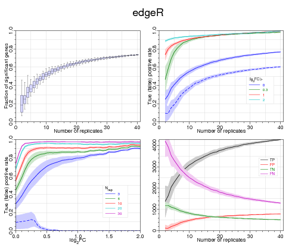

.. install:

.. _install:

***************
Getting Started
***************

This is a brief run-through of how to reproduce (some of) the key performance 
results for the Differential Gene Expression (DGE) tools examined in 
:ref:`Schurch et. al. (2015) <paper2>`. This is not an extensive 
description of how to use all the scripts in the repository or even all the 
scripts used to generate the results and plots presented in 
:ref:`Gierlinski et. al. (2015) <paper1>`. 

============
Get the Data
============

--------
Raw Data
--------

The raw fastq data for The Great RNA-seq Experiment has been deposited in the 
`European Nucleotide Archive <http://www.ebi.ac.uk/ena>`_ and can be 
downloaded from `here <http://www.ebi.ac.uk/ena/data/view/PRJEB5348>`_. The 
lane, sample and replicate metadata for the rather anonymously named ENA fastq 
files can be found in 
:ref:`ENAdata_ERP004763_sample_mapping.tsv <ENAdata_ERP004763_sample_mapping_tsv>` or can be 
downloaded independently from `figshare here 
<https://figshare.com/articles/Metadata_for_a_highly_replicated_two_condition_yeast_RNAseq_experiment_/1416210>`_.

For Section 3.1 of :ref:`Gierlinski et. al. (2015) <paper1>` the lane data are 
examined independently but for the majority of the work presented in both
papers the lane data are summarized to give biological replicate data. The 
simplest way to do that is to cat the lane fastq files for each biological 
replicate into a single file for each replicate.

The resulting reads then need to be aligned to genome with `your 
preferred alignment tool <https://en.wikipedia.org/wiki/List_of_RNA-Seq_bioinformatics_tools#Spliced_aligners>`_.
We used `bowtie v2.0.0 (beta7) 
<https://github.com/genome-vendor/bowtie/tree/b2.0.0-beta7>`_ and `TopHat 
v2.0.5 <http://ccb.jhu.edu/software/tophat/downloads/tophat-2.0.5.Linux_x86_64.tar.gz>`_ 
to align the reads to the Saccharomyces cerevisiae EF4 genome from Ensembl 
release v68. This specific Ensembl release is no longer available, but the EF4 
genome is available 
`here <http://jan2013.archive.ensembl.org/Saccharomyces_cerevisiae/Info/Index>`_
as part of the Ensembl v70 archive. 

If the alignment tool doesn't produce `BAM format 
<https://samtools.github.io/hts-specs/SAMv1.pdf>`_ output by default, then
the output alignments will then need to be converted to BAM format. The BAM 
files need to be position sorted and indexed. There are several tools availble 
for these steps including  `samtools <http://www.htslib.org/>`_, `sambamba 
<https://github.com/lomereiter/sambamba>`_ and `Picard 
<http://broadinstitute.github.io/picard/>`_.

The BAM files (*.bam*) and their indexes (*.bai*) files for the replicates of 
each condition then need to be separated into two individual directories that 
will be passed to the script :ref:`generic_wrapper.py <generic_wrapper_autodoc>`
which will generate the count summaries from the bam data.

------------------------
Pre-processed count data
------------------------

Alternatively, :ref:`generic_wrapper.py <generic_wrapper_autodoc>` can operate 
directly on appropriately named (*<name>.gbgout* by default) `htseq-count 
<http://www-huber.embl.de/users/anders/HTSeq/doc/count.html>`_ count data by 
specifying the ``--precounts`` flag (again separated into two directories, one 
for each condition). For convenience, the count files for each condition from 
our analysis are included in the repository as gzipped tar archives in the 
*Preprocessed_data* directory. We'll perform the example run in the directory 
*testDGE*::
	
	mkdir testDGE
	cd testDGE
	mkdir WT
	mkdir Snf2
	cd WT
	tar zxvf Preprocessed_data/WT_countdata.tar.gz
	cd ../Snf2
	tar zxvf Preprocessed_data/Snf2_countdata.tar.gz
	cd ../
	
=================================================
Generating the bootstrap DGE data for a DGE tools
=================================================

The performance of each DGE tool as a function of replicate number and 
expression fold‐change was evaluated by comparing the DGE results from 
sub‐sets of the full set of clean replicates against a ‘gold standard’ set of 
DGE results calculated for each tool using the full set of clean replicates. 
These bootstrap DGE results are computed by providing the 
:ref:`generic_wrapper.py <generic_wrapper_autodoc>` script with details of which
tool to use, how many bootstrap calculations to perform, how many replicates to 
use for each bootstrap.

By default :ref:`generic_wrapper.py <generic_wrapper_autodoc>` runs in 
DRMAA-cluster-aware mode that spawns a set of cluster jobs for performing the 
bootstrap runs efficiently (please make sure that the relevant environmental 
variables are set appropriately for the python DRMAA library to successfully 
access your cluster). If you do not have access to a DRMAA-compatible cluster, 
the bootstraps can be run serially on a single machine by specifying the 
``--nocluster`` flag but this is likely to take a considerable amount of time. 

The :ref:`generic_wrapper.py <generic_wrapper_autodoc>`. needs the following 
external tools to run:
 
  * `samtools <http://sourceforge.net/projects/samtools/files/samtools/0.1.18/>`_ (``--samtoolspath``)
  * `R v3.2.2 <https://cran.r-project.org/src/base/R-3/R-3.2.2.tar.gz>`_ (``--Rpath``)
  * `perl v5.8.9 <http://dev.perl.org/perl5/news/2008/perl-5.8.9.html>`_ (``--perlpath``)

By default these are set to */usr/bin/<perl\/Rscript\/samtools>*. If the 
defaults are incorrect for your setup you'll need to provide the full paths to these 
tools.

We'll also need to provide the details of the DGE tool to use, 
the path data, which data are bad, the gene annotations, the number of 
bootstrap iterations to perform and the number of replicates to use from each 
condition for each bootstrap and, finally, the output sqlite database to write
the results too (the path for this output needs to exist already) and a log 
file to record out run [#f1]_:

  * ``-r`` - the path to the DGE tool Rscript to use. These can be found in the *DE_tool_scripts* directory.
  * ``-d`` - the path to the two data directories to use. For our example this is *testDGE*.
  * ``-e`` - a file listing the bad replicates to be excluded. An example file can be found in the *General* directory but this will need to be edited to reflect your data location.
  * ``-a`` - the path to the gene annotation we want to use. This can be found in the *Annotations* directory.
  * ``-b`` - the number of bootstrap runs to perform.
  * ``-k`` - the number of replicates to select for each bootstrap.
  * ``-o`` - the output file.
  * ``-l`` - the log file.

In our case the resulting command looks like this::

	Bootstrapping/generic_wrapper.py -r DE_tool_scripts/edgeR.R -d testDGE -a Annotations/Saccharomyces_cerevisiae.EF4.68.gtf
	-b 10 -k 3 --precounts -e General/exclude_badreps.lst -o edgeRa/edgeR_k03.db -l edgeR_k03.log

This should produce a single sqlite database (*.db*) file containing all the 
results and logfiles from these bootstrap runs and a log file. In order to make
the plots from :ref:`Schurch et. al. (2015) <paper2>` we will need to run this 
for and range of tool, each with a range of sample sizes, ``k=2..40``. The 
wrapper bash-scripts 
:ref:`qsub_bootstraps_withexcludelist.sh <qsub_bootstraps_withexcludelist_shdoc>` 
& :ref:`qsub_bootstraps_withoutexludelist.sh <qsub_bootstraps_withoutexludelist_shdoc>` 
are quick-and-dirty utility scripts to automate stepping through ``-k``. The 
final result should be a set of 39 sqlite databases and their associated logfiles for 
each tool.

=================================
Generating Tool Performance Plots
=================================

In order to assess the performance of each tool, first we need to define a 
'truth' against which to test it. In :ref:`Schurch et. al. (2015) <paper2>` we
defined the truth for each tool as the differential expression calls using that 
tool with the full set of 'clean' replicate data. For convenience, these 
gold-standard truths are provided for the tools examined in 
:ref:`Schurch et. al. (2015) <paper2>` as a compredssed tar archive in the 
*Preprocessed_data* directory. 

Alternatively, you can generate the appropriate gold-standard
truth with a call to :ref:`generic_wrapper.py <generic_wrapper_autodoc>`
without specifying any replicate subselection or bootstrapping [#f2]_::

	Bootstrapping/generic_wrapper.py -r DE_tool_scripts/edgeR.R -d testDGE -a Annotations/Saccharomyces_cerevisiae.EF4.68.gtf 
	--precounts -e General/exclude_badreps.lst -o edgeR_gold.txt -l edgeR_gold.log

This may take a few minutes since the code calls the perl Ensembl API to 
provide gene names and descriptions for the output results.

------------------------------------------
Individual tool performance plots (Fig. 1)
------------------------------------------

To assess the performace of each individual tool we then look at the total 
number of genes called as Significantly Differentially Expressed (SDE) in each 
bootstrap replicate subselection and compare this with the tool gold-standard 
truth to define the True Positive, False Positive, True Negative and 
False Negative Rates (TPR, FPR, TNR, FNR) as a function of the number of 
replicates and as a function of fold-change threshold. 

First we need to summarize the boostrap data for the tool using 
:ref:`make_powerstats_db.pl <make_powerstats_db_perldoc>`. This script submits 
jobs to a DRMAA-enabled cluster and will not operate on a stand-alone machine.
Before we run this script  we need to edit the configuration file 
*de_tests.txt* to point the *fullfile* field at the gold-standard truth file 
for each tool and to point the *repfile* field to the bootstrap database files 
we just created for each tool. Note that the *repfile* field can use perl 
regex wildcards and because of historical oddities the entry must end with 
.tsv instead of .db (don't worry, it'll find the right .db files if you follow 
along!).

For our example using *edgeR* the entry looks like this::

	TEST edger
	name = edgeR
	repfile = edgeR/edgeR_k%02d.tsv
	fullfile = edgeR_gold.txt
	adjustment = bh
	FCsig = -1

With that done we can then run 
:ref:`make_powerstats_db.pl <make_powerstats_db_perldoc>` [#f3]_::

	DE_tool_comparison/make_powerstats_db.pl -test=edger -testinfofile=General/de_tests.txt
	-script=DE_tool_comparison/one_bs_powerstats.pl -genlist=General/genlist.tsv -powerdir=edger_powerstats
	-reffcfile=Preprocessed_data/full_rep_gold_standards/WT_Snf2_deseq_clean_mw_test.tsv

This will create a set os summary statistics files in the *edger_powerstats*
directory. The final plots are made with :ref:`plot_powerstats_db.pl <plot_powerstats_db_perldoc>`
which uses these summary statistic files and outputs a postscript file::

	Plotting/plot_powerstats_db.pl -test=edger -psfile=powertest_edger.ps -testinfofile=General/de_tests.txt 
	-powerdir=edger_powerstats minnrep=2

The result should be the following four panel postscript figure showing the 
performance of the tool:

================
Further analysis
================

Generating the other figures for the paper is a more involved process and is not
covered by this introduction. For help using the codebase to generate these 
figures, or if you have a tool you'd like us to add into our analysis and 
generate figures for, please contact 
`Prof. Geoff Barton <http://www.compbio.dundee.ac.uk/contact.html>`_
at the `University of Dundee <http://www.dundee.ac.uk/>`_.

.. rubric:: Footnotes

.. [#f1] Please also ensure that your *PYTHONAPTH* environmental variable includes the path to the root directory of the codebase.
.. [#f2] Please also ensure that your *PERL5LIB* environmental variable includes the path to the *Modules* directory of the codebase and includes the full path to the ensembl API *bioperl-live* and *modules* directories.
.. [#f3] Please ensure that your *PERL5LIB* environmental variable includes the path to the *Modules* directory of the codebase.